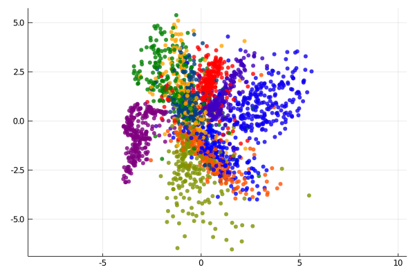

# Variational Autoencoder(VAE)

## Training
```shell
cd vision/vae_mnist
julia --project vae_mnist.jl
```

Original iamges


10 epochs


20 epochs


## Visualization
```shell
julia --project vae_plot.jl
```
Visualization of latent space



Visualization of 2D manifold

